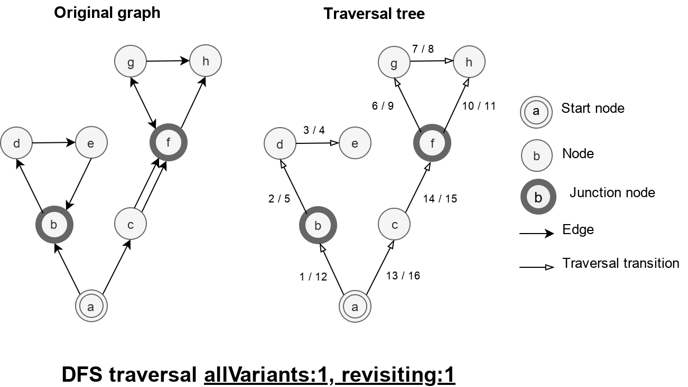

## Option allVariants

An option that controls the ability to re-visit a nodes in graph with junctions.

If `allVariants : 0`, then routine does not change the traversal of graph.

If `allVariants : 1`, then routine traverse junctions once.

If `allVariants : 2`, then routine re-visit junctions and makes traversal of next nodes.
